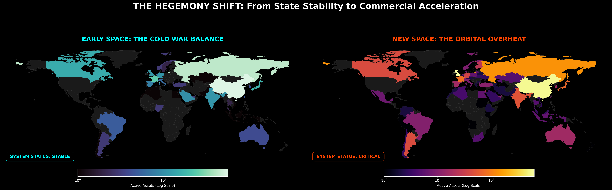
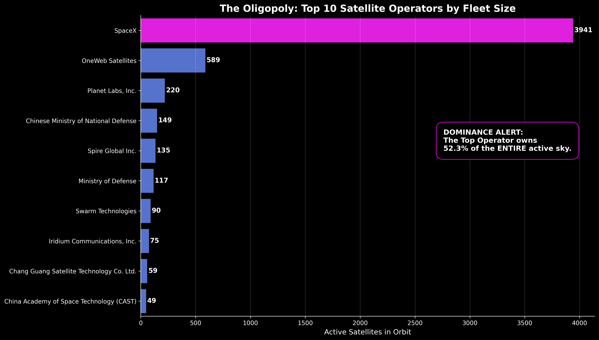
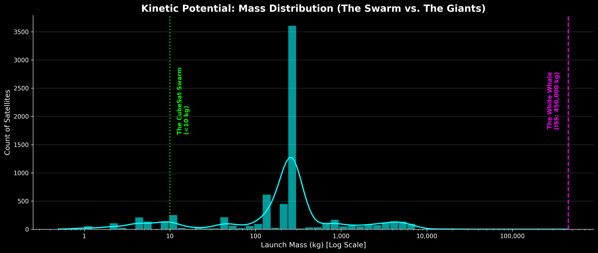
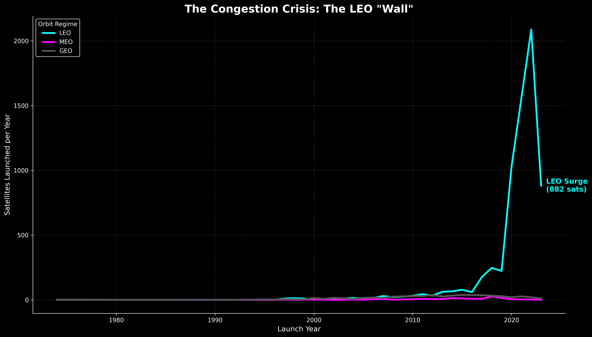
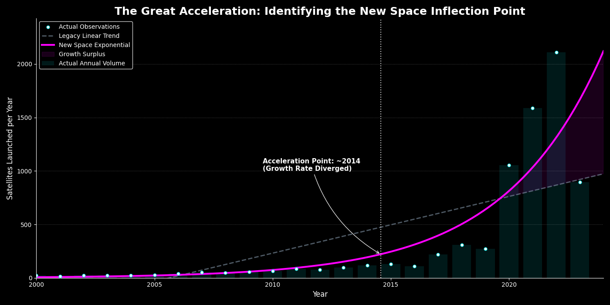

# Orbital Clutter: Mapping the Kessler Acceleration

**Lead Analyst:** James Glosser  
**Course:** Data Analysis Pathway with **Code:You**

---

### **Project Description**

This project investigates the growing crisis of space debris and satellite congestion in Low Earth Orbit (LEO). By merging active satellite data with the **CelesTrak SATCAT Registry**, this analysis quantifies the **Visibility Gap** and evaluates the environment against the **Kessler Syndrome**—the tipping point where orbital collisions become a self-sustaining cascade.

### **Key Insights**

- **The 47.6% Zombie Blind Spot:** Analysis of the 'Visibility Gap' reveals that nearly half of all tracking failures are caused by **Inactive 'Zombie' Satellites**. This debunks the myth that small fragmentation is the primary driver of catalog uncertainty; the real risk is large, uncontrolled payloads drifting through commercial lanes.
- **The 2014 Great Kessler Acceleration:** Mathematical modeling identifies **2014** as the critical "Decoupling Point." Since this year, orbital growth has abandoned the linear 20th-century model and locked into an **Exponential Kessler Arc**, tripling in velocity due to commercial proliferation.
- **The Kessler Clock (2.8-Year Doubling Time):** Tactical audits of the active fleet reveal a growth rate that doubles the orbital population every ~2.8 years. This velocity creates an "Active Kinetic Load" that outpaces legacy debris mitigation guidelines.
- **The 100% Density Achievement:** This project utilized **Physics-Informed Reconstruction** to achieve 100% data density across 20+ physical and orbital features for the active fleet, revealing the true kinetic energy of the "invisible" population.
- **The Kessler Canyon (Orbital Segregation):** KDE analysis reveals a distinct segregation of risk. While active satellites cluster in the "Commuter Lane" (~550km), massive abandoned rocket bodies form a permanent "Deadly Ring" at ~900km.

---

### **Visualizing the Crisis**

#### **1. The Intelligence Gallery (Phase 1: Active Environment)**

**The Geospatial Hegemony Shift**

_Mapping the physical control of orbital space. This audit tracks the transition from state-actor dominance to a multi-polar commercial landscape, identifying the geographical origins of the kinetic load._

**The Oligopoly of Orbit**

_Identification of the specific entities driving the commercial surge. This visual highlights how a handful of "Commercial Titans" now control the majority of active LEO assets._

**Kinetic Mass Profiling (The Swarm vs. The Giants)**

_Logarithmic scaling of the active fleet. In a collision event, mass equates to "shrapnel potential"; this identifies "High-Value" targets versus the CubeSat swarm._

**Vertical Congestion (LEO vs. The Rest)**

_Mapping the "Shell of Density." This chart proves that exponential growth is almost exclusively contained within the 500-600km LEO corridor._

#### **2. The Strategic Synthesis (Executive View)**

_The definitive "Strategic Synthesis" identifying the 2014 Pivot Point. The Magenta region represents the "Risk Surplus"—the unplanned mass creating a debris burden legacy guidelines were never designed to handle._

---

### **Scientific Methodology**

#### **1. UCS Pipeline: The Physics Reconstruction Engine**

To normalize the active satellite registry, we built a tiered imputation engine to finalize **7,542** unique assets:

- **The "White Whale" Exception:** Manually pinned the **ISS** mass (450,000 kg) to prevent statistical skew.
- **Grouped Median Imputation:** Filled missing `Launch Mass` and `Power` based on **Orbit Class**.
- **Derived Dry Mass:** Calculated structural mass fractions to ensure 1:1 join-readiness.

#### **2. SATCAT Pipeline: Standalone Registry Normalization**

Processing the full historical registry of ~60,000 objects to establish a baseline for the global environment:

- **In-Orbit Boolean Logic:** Implemented a decay-date filter to isolate current kinetic threats.
- **Synthetic Mass Fill:** Applied conservative ESA-standard proxies for Rocket Bodies (2,000 kg) and Debris (0.1 kg).

#### **3. Orbital Risk Synthesis: Closing the Visibility Gap**

The final integration layer where UCS and SATCAT datasets are merged to generate the `kinetic_master.csv`. This phase performs the "Zombie" identification and final data augmentation.

---

### **AI Attribution & Usage Disclosure**

In alignment with professional data science standards, I utilized the **Gemini** model family as a technical thought partner. I targeted my usage of AI toward specific engineering and analytical goals:

- **Mathematical Prototyping:** I collaborated with AI to prototype the `scipy.optimize` curve-fitting logic and the HUD-style visualization coordinate transforms for the Kessler Clock.
- **Data Engineering Audit:** I used AI to peer-review my **Physics Reconstruction Engine** and verify the accuracy of the grouped median imputation logic.
- **Technical Documentation:** I utilized AI to assist with text formatting for the intelligence briefings and to troubleshoot shell-specific environment activation commands.

**Note:** All analytical decisions, data filtering thresholds (The Kessler Canyon), and strategic findings (The Great Acceleration) are my original conclusions based on the processed data.

---

### **Installation & Setup**

To ensure the analysis runs with the correct library versions, please use a virtual environment. This prevents dependency conflicts and ensures the mathematical models and visualizations render as intended.

1. **Clone the repository and navigate to the project root.**
2. **Create and Activate the Virtual Environment:**
   - Create: `python -m venv venv`
   - Activate - Windows (Git Bash): `source venv/Scripts/activate`
   - Activate - Windows (Command Prompt): `.\venv\Scripts\activate`
   - Activate - Windows (PowerShell): `.\venv\Scripts\Activate.ps1`
   - Activate (Mac/Linux): `source venv/bin/activate`
3. **Install Project Dependencies:** `pip install -r requirements.txt`
4. **Data Verification:** Ensure raw data files are in `data/original/` and cleaned outputs are directed to `data/clean/`.
5. **Execution Order:**
   - **`ucs_cleanup.ipynb`**: Cleans and reconstructs the active satellite database.
   - **`satcat_cleanup.ipynb`**: Normalizes the global satellite catalog and filters for current objects.
   - **`orbital_risk_synthesis.ipynb`**: Merges both cleaned datasets to create the `kinetic_master.csv`.
   - **`active_fleet_intelligence.ipynb`**: Explores the active fleet and calculates the Kessler Clock.
   - **`strategic_analysis.ipynb`**: Final high-level analysis of the global kinetic environment.

---

### **License**

**Creative Commons Attribution-NonCommercial 4.0 International (CC BY-NC 4.0)**

This work is licensed under a [Creative Commons Attribution-NonCommercial 4.0 International License](http://creativecommons.org/licenses/by-nc/4.0/).

**You are free to:**

- **Share** — copy and redistribute the material in any medium or format.
- **Adapt** — remix, transform, and build upon the material.

**Under the following terms:**

- **Attribution** — You must give appropriate credit, provide a link to the license, and indicate if changes were made.
- **NonCommercial** — You may **NOT** use the material for commercial purposes. This includes selling the code, charging for access to the analysis, or using the models within a commercial product or service.

---

