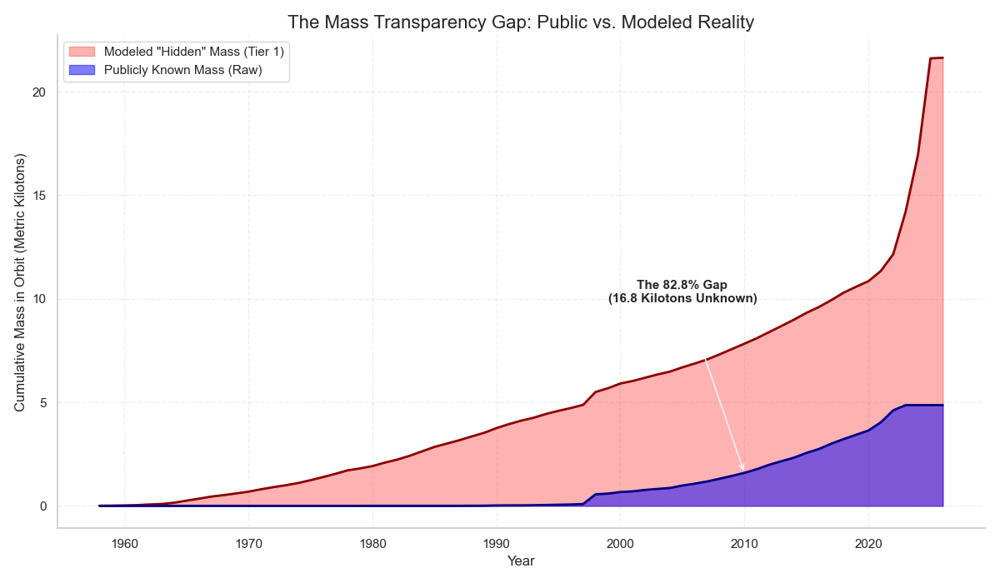
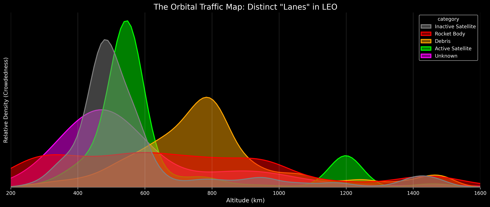

# Orbital Clutter: Analyzing the Pollution of LEO

**Lead Analyst:** James Glosser  
**Course:** Data Analysis Pathway with **Code:You**

---

### Project Description

This project investigates the growing crisis of space debris and satellite congestion in Low Earth Orbit (LEO). By merging active satellite data from the **Union of Concerned Scientists (UCS)** with the **CelesTrak SATCAT**, this analysis quantifies the **Visibility Gap** and evaluates the environment against the **Kessler Syndrome**—the tipping point where orbital collisions become self-sustaining.

### Key Insights

- **The "Kessler Canyon" (Orbital Segregation):** KDE analysis reveals a distinct segregation of risk in LEO. While active satellites cluster in the "Commuter Lane" (~550km), massive abandoned rocket bodies form a permanent "Deadly Ring" at ~900km. This creates a high-mass "canyon walls" effect, where the heaviest debris looms directly above modern infrastructure.
- **The 82.8% Mass Transparency Gap:** While tracking 32,000+ objects, high-fidelity mass data is only available for ~17% of the catalog. By merging UCS and SATCAT data, this project identifies that over 80% of the mass in orbit is "invisible" to standard analysis.
- **The 50% Visibility Gap:** Nearly half of all objects with "unhealthy" tracking status (e.g., NEA - No Elements Available) are intact Inactive Satellites. These "Zombie Satellites" represent massive, unmonitored kinetic risks.
- **Evidence of Kessler Syndrome:** Analysis of LEO population trends shows a transition from linear growth to an exponential curve, punctuated by catastrophic fragmentation events in 2007 and 2009.
- **Active Satellite Trends (UCS Data):** Analysis of the UCS dataset reveals the explosion of commercial "Mega-Constellations." By visualizing satellite purposes and operators, this project identifies which sectors are contributing most to LEO density.

### Visualizing the Crisis

#### 1. The Mass Gap (Tier 1 Analysis)

_Figure: The "Reality Check" reveals the 82.8% Mass Gap. The grey area represents the massive amount of kinetic energy (rocket bodies/dead satellites) that raw public data fails to account for._

#### 2. The Kessler Canyon (Tier 2 Analysis)

_Figure: The "Orbital Traffic Map" answers "Where is the mass?" It reveals distinct highways of risk: the Green Peak (Starlink Economy) sits directly below the Red Peak (The Rocket Body Graveyard)._

---

### Future Goals: The Advanced Analysis (`adv_analysis.ipynb`)

With the data cleaning pipeline complete (Tier 1 Mass & Tier 2 Physics), the next phase of this project will focus on **Kinetic Threat Modeling**:

- [ ] **Comparative Velocity Modeling:** Visualize the kinetic energy difference between natural meteoroids (~20 km/s) and man-made orbital debris (~7.8 km/s).
- [ ] **Density Threshold Mapping:** Create a "Kessler Limit" overlay to show exactly where man-made density exceeds the background natural environment.
- [ ] **Risk Attribution:** Quantify the probability of a "Mission Ending Strike" from a 1cm man-made fragment versus a natural micrometeoroid of the same size.
- [ ] **Predictive Tracking Decay:** Use Correlation Matrices to determine if object age is a leading indicator for "unhealthy" tracking status.
- [ ] **Physical Risk Modeling:** Utilize RCS (Radar Cross Section) data to calculate the specific collision probability of "Zombie Satellites" versus standard debris fragments.
- [ ] **Geospatial Ground-Track Mapping:** Integrate `GeoPandas` to project orbital paths onto terrestrial maps, identifying high-density flyover zones for inactive debris.

---

### Installation & Setup

1. Clone the repository.
2. Ensure data files are in `data/original/` and `data/clean/`.
3. **Execution Order:**
   - Run `ucs_cleanup.ipynb` (Standardizing UCS records)
   - **`satcat_cleanup.ipynb` (The Cleaning Pipeline):**
     - **Tier 1 (Mass Imputation):** Uses ESA proxies to fill the 82.8% mass gap for Rocket Bodies and inactive payloads.
     - **Tier 2 (Physics Standardization):** Sanitizes RCS (Radar Cross Section) and orbital geometry to prepare for kinetic energy modeling.
   - Run `ucs_eda.ipynb` (Visualizing active satellite distribution and ownership)
   - Run `satcat_eda.ipynb` (Main Analysis: Debris, Growth, and Tracking Health)

---

### License

This project is licensed under the MIT License.
