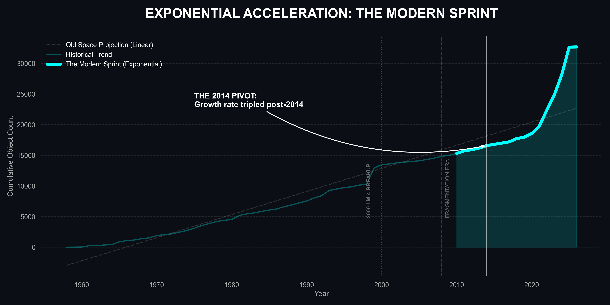

# Orbital Clutter: Mapping the Kessler Acceleration

**Lead Analyst:** James Glosser  
**Course:** Data Analysis Pathway with **Code:You**

---

### **Project Description**

This project investigates the growing crisis of space debris and satellite congestion in Low Earth Orbit (LEO). By merging active satellite data with the **CelesTrak SATCAT Registry**, this analysis quantifies the **Visibility Gap** and evaluates the environment against the **Kessler Syndrome**—the tipping point where orbital collisions become a self-sustaining cascade.

### **Key Insights**

- **The 47.6% Zombie Blind Spot:** Analysis of the 'Visibility Gap' reveals that nearly half of all tracking failures are caused by **Inactive 'Zombie' Satellites**. This debunks the myth that small fragmentation is the primary driver of catalog uncertainty; the real risk is large, uncontrolled payloads drifting through commercial lanes.
- **The 2014 Great Kessler Acceleration:** Mathematical modeling identifies **2014** as the critical "Decoupling Point." Since this year, orbital growth has abandoned the linear 20th-century model and locked into an **Exponential Kessler Arc**, tripling in velocity due to commercial proliferation.
- **The 100% Density Achievement:** This project utilized **Physics-Informed Reconstruction** to achieve 100% data density across 20+ physical and orbital features for the active fleet, revealing the true kinetic energy of the "invisible" population.
- **The Kessler Canyon (Orbital Segregation):** KDE analysis reveals a distinct segregation of risk. While active satellites cluster in the "Commuter Lane" (~550km), massive abandoned rocket bodies form a permanent "Deadly Ring" at ~900km.

---

### **Visualizing the Crisis**

#### **1. The Great Kessler Acceleration (Initial Discovery)**

_The first point of discovery using the UCS Satellite Database. This model identifies the precise decoupling point where active satellite deployment transitioned from a linear progression to an exponential arc._

#### **2. The Modern Sprint (Full Catalog Validation)**

_Validation of the acceleration using the full 32,000+ object SATCAT registry. This visual confirms that the 2014 Pivot is not just an active-satellite trend, but an environment-wide shift affecting all orbital categories._

#### **3. The Mass Gap (Tier 1 Analysis)**

_The "Reality Check" reveals the 82.8% Mass Gap. The **Red** area represents the massive amount of "Hidden" kinetic fuel identified through Tier 1 ESA proxy modeling._

#### **4. The Double Threat: Population vs. Kinetic Fuel**

_A dual-axis synthesis of the crisis. While the **Population (Blue)** is exploding post-2014, the total **Kinetic Mass (Magenta)** continues its relentless climb, creating a pincer maneuver of orbital risk._

#### **5. The Kessler Canyon (The Traffic Map)**

_Mapping the physical highways of risk. This Kernel Density Estimation (KDE) reveals the high-density **Commuter Lane (Lime)** sitting precariously beneath the high-mass **Deadly Ring (Red)** of legacy rocket bodies._

---

### **Scientific Methodology**

#### **1. UCS Pipeline: The Physics Reconstruction Engine**

To normalize the active satellite registry, we built a tiered imputation engine to finalize **7,542** unique assets:

- **The "White Whale" Exception:** Manually pinned the **ISS** mass (450,000 kg) to prevent statistical skew.
- **Grouped Median Imputation:** Filled missing `Launch Mass` and `Power` based on **Orbit Class** and **Mission Purpose**.
- **Derived Dry Mass:** Calculated the **Structural Mass Fraction** to derive `Dry Mass` from `Launch Mass`.
- **Integrity & Deep Scrub:** Global string sanitization and temporal synchronization (aligned to Simulation Year 2026) to ensure 1:1 join-readiness.
- **Sector & Mission Flagging:** Standardized 30+ raw mission types into a machine-readable controlled vocabulary.

#### **2. SATCAT Pipeline: Closing the Visibility Gap**

Implemented a **Synthetic Mass Fill** using conservative averages from ESA debris reports:

- **Rocket Bodies:** Assigned **2,000 kg**.
- **Inactive Satellites:** Assigned **1,000 kg**.
- **Debris:** Assigned **0.1 kg**.

---

### **AI Attribution & Usage Disclosure**

In alignment with professional data science standards, I utilized the **Gemini 3** model family (**Flash & Pro**) as a technical thought partner and pair-programmer. Developing within **VS Code** and utilizing its integrated terminal and extensions, I targeted my usage of AI toward specific engineering and analytical goals:

- **Mathematical Prototyping:** I collaborated with **Gemini 3 Pro** to prototype the `scipy.optimize` curve-fitting logic and the RMSE statistical validation for the 2014 Pivot.
- **Data Engineering Audit:** I used **Gemini 3 Flash** to peer-review my **Physics Reconstruction Engine** and verify the accuracy of the grouped median imputation logic.
- **Technical Documentation:** I utilized AI to assist with text formatting for the intelligence briefings and to troubleshoot shell-specific environment activation commands (Git Bash vs. PowerShell).

**Note:** All analytical decisions, data filtering thresholds (The Kessler Canyon), and strategic findings (The Double Threat) are my original conclusions based on the processed data.

---

### **Installation & Setup**

1. **Clone the repository.**
2. **Create and Activate the Virtual Environment:**
   - `python -m venv venv`
   - Activate: `source venv/Scripts/activate` (Mac/Linux) or `.\venv\Scripts\activate` (Windows)
3. **Install Dependencies:**
   - `pip install -r requirements.txt`
4. **Execution Order:**
   - **`ucs_cleanup.ipynb`**: Normalization & Physics Reconstruction (Active Satellites).
   - `ucs_eda.ipynb`: Initial Pivot Identification.
   - **`satcat_cleanup.ipynb`**: SATCAT Merge & Debris Proxying (Tier 1 Imputation).
   - `satcat_eda.ipynb`: Final Intelligence Briefing.

---

### **License**

This project is licensed under the MIT License.

