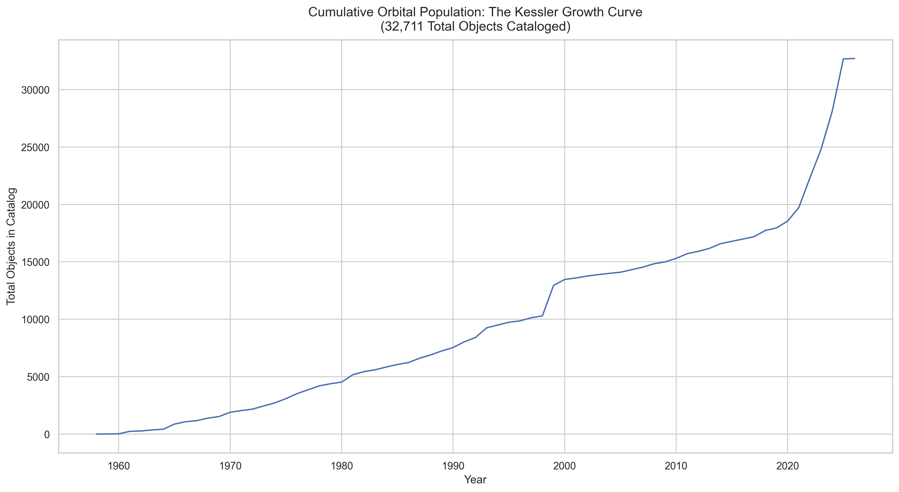
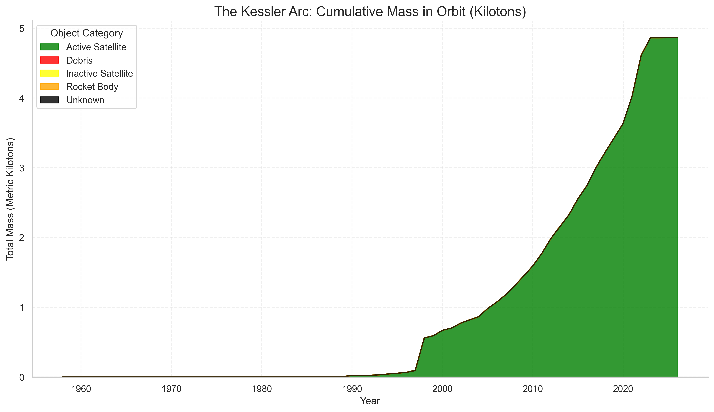
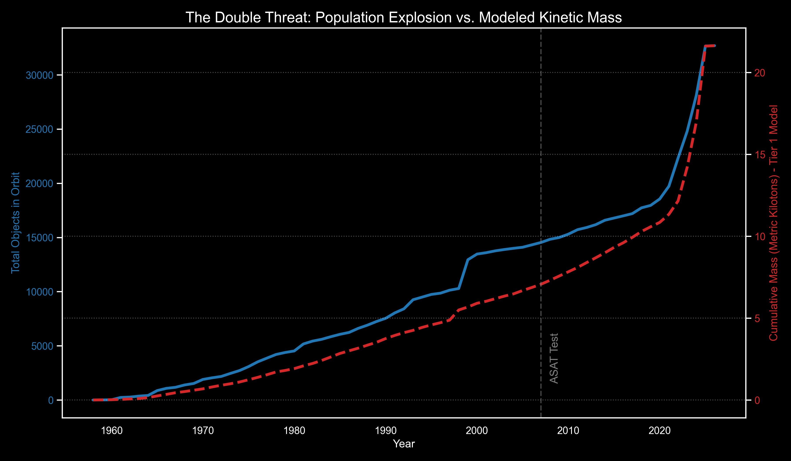

# Orbital Clutter: Analyzing the Pollution of LEO

**Lead Analyst:** James Glosser  
**Course:** Data Analysis Pathway with **Code:You**

---

### Project Description

This project investigates the growing crisis of space debris and satellite congestion in Low Earth Orbit (LEO). By merging active satellite data from the **Union of Concerned Scientists (UCS)** with the **CelesTrak SATCAT**, this analysis quantifies the **Visibility Gap** and evaluates the environment against the **Kessler Syndrome**—the tipping point where orbital collisions become self-sustaining.

### Key Insights

- **The 50% Visibility Gap:** Nearly half of all objects with "unhealthy" tracking status (e.g., NEA - No Elements Available) are intact Inactive Satellites. These "Zombie Satellites" represent massive, unmonitored kinetic risks.
- **Active Satellite Trends (UCS Data):** Analysis of the UCS dataset reveals the explosion of commercial "Mega-Constellations." By visualizing satellite purposes and operators, this project identifies which sectors are contributing most to LEO density.
- **Evidence of Kessler Syndrome:** Analysis of LEO population trends shows a transition from linear growth to an exponential curve, punctuated by catastrophic fragmentation events in 2007 and 2009.
- **The 82.8% Mass Transparency Gap:** While tracking 32,000+ objects, high-fidelity mass data is only available for ~17% of the catalog. By merging UCS and SATCAT data, this project identifies that over 80% of the orbital population is effectively "weightless" in public records, masking the true physical scale of the threat and establishing a "Conservative Lower Bound" for orbital kinetic energy.

---

### Technical Highlights

- **Growth Modeling:** Applied mathematical best-fit curves to distinguish between linear launch rates and exponential debris accumulation.
- **Multi-Dataset Visualization:** Created comparative plots using UCS data to show the ratio of commercial vs. government payloads and their intended orbital classes.
- **Boolean Masking:** Isolated "unhealthy" tracking flags to identify which object categories pose the greatest risk to orbital situational awareness.
- **Data Merging:** Integrated disparate datasets via **NORAD IDs** to separate active infrastructure from historical clutter.
- **Categorical Proportions:** Utilized pie charts and grouped counts to visualize the dominance of dead payloads in the tracking catalog.
- **Relational Data Mapping:** Cross-dataset lookup table using NORAD IDs to bridge the Union of Concerned Scientists (UCS) mass metrics with the CelesTrak orbital catalog.
- **Dual-Axis Trend Analysis:** Developed synchronized visualizations to compare the growth of orbital population (count) against cumulative mass (kg) to identify and visualize shifts in orbital density.

---

### Data Sources

- **Union of Concerned Scientists (UCS):** In-depth records of active satellites (Owner, Purpose, Mass, Orbit).
- **CelesTrak (NORAD/SATCAT):** Historical catalog of all man-made objects ever launched and their current tracking statuses.

---

### **Project Visualizations**

#### **The Kessler Growth Curve**

This chart demonstrates the transition from linear orbital growth to the current exponential "Hockey Stick" curve.

#### **The Kessler Arc: Cumulative Mass in Orbit**

This visualization represents the total metric tonnage of material currently in orbit over time. Due to the **82.8% Transparency Gap**, this curve establishes a conservative lower bound by treating unknown masses as 0kg.

#### **The Double Threat: Population vs. Mass Accumulation**

This dual-axis visualization reveals the critical relationship between the number of orbital objects and the total kinetic "fuel" (mass) in orbit. While the population count (blue) shows the crowding of space, the cumulative mass (red) identifies the total energy available for a potential Kessler cascade.

_Note: The mass curve represents a conservative lower-bound estimate due to the [Mass Transparency Gap](#key-insights) identified during analysis._

---

### Stretch Goals & Future Roadmap: Collision Risk Assessment

While this project quantifies man-made orbital congestion, the ultimate goal is to evaluate the relative risk to modern space infrastructure.

**Upcoming Analysis: Man-Made vs. Natural Hazard Flux**
Current research indicates that for the first time in history, the risk of satellite failure due to man-made debris has surpassed the risk from natural meteoroids. I plan to integrate a "Flux Comparison" analysis using NASA’s Meteoroid and Orbital Debris (MMOD) estimates.

**Proposed To-Do List:**

- [ ] **Tier 1: Synthetic Mass Modeling:** Implement categorical mass fills (e.g., 3,000kg for Rocket Bodies) to provide a more realistic proxy for the 82.8% data gap.
- [ ] **Tier 2: RCS-Based Kinetic Modeling:** Utilize Radar Cross Section (RCS) data to calculate specific mass estimates for debris fragments based on their radar signature.
- [ ] **Comparative Velocity Modeling:** Visualize the kinetic energy difference between natural meteoroids (~20 km/s) and man-made orbital debris (~7.8 km/s).
- [ ] **Density Threshold Mapping:** Create a "Kessler Limit" overlay to show exactly where man-made density exceeds the background natural environment.
- [ ] **Risk Attribution:** Quantify the probability of a "Mission Ending Strike" from a 1cm man-made fragment versus a natural micrometeoroid of the same size.
- [ ] **Predictive Tracking Decay:** Use Correlation Matrices to determine if object age is a leading indicator for "unhealthy" tracking status.
- [ ] **Physical Risk Modeling:** Utilize RCS (Radar Cross Section) data to calculate the specific collision probability of "Zombie Satellites" versus standard debris fragments.
- [ ] **Geospatial Ground-Track Mapping:** Integrate `GeoPandas` to project orbital paths onto terrestrial maps, identifying high-density flyover zones for inactive debris.

---

### Installation & Setup

1. Clone the repository.
2. Ensure data files are in `data/original/` and `data/clean/`.
3. **Execution Order:**
   - Run `ucs_cleanup.ipynb` (Standardizing UCS records)
   - Run `satcat_cleanup.ipynb` (Standardizing SATCAT/CelesTrak records)
   - Run `ucs_eda.ipynb` (Visualizing active satellite distribution and ownership)
   - Run `satcat_eda.ipynb` (Main Analysis: Debris, Growth, and Tracking Health)

---

### License

This project is licensed under the MIT License.
