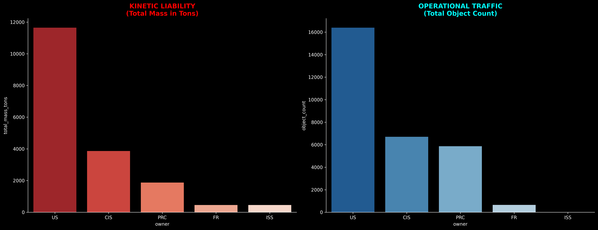
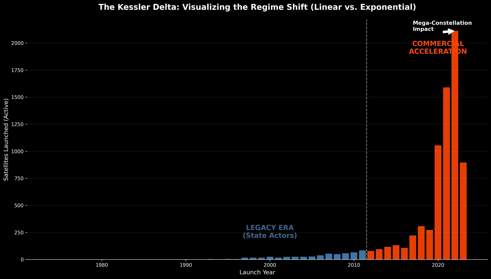
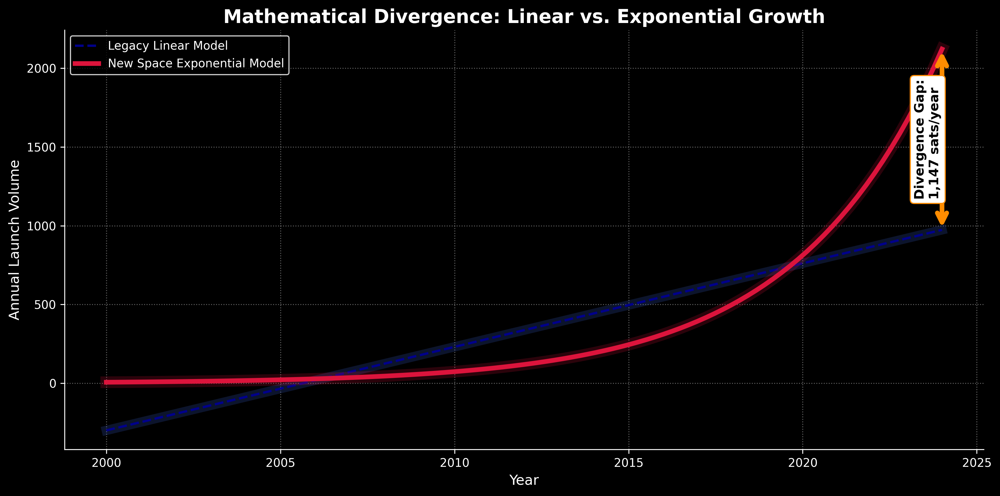
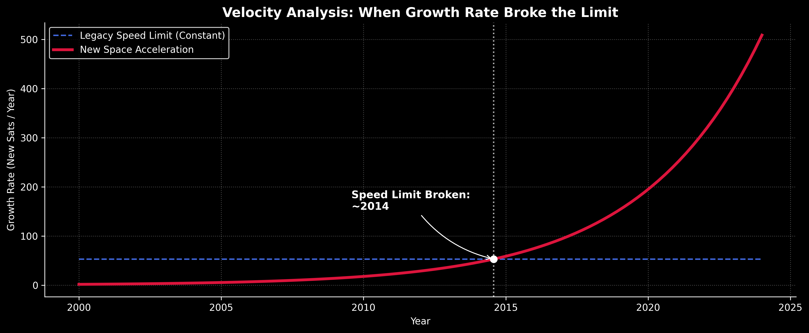
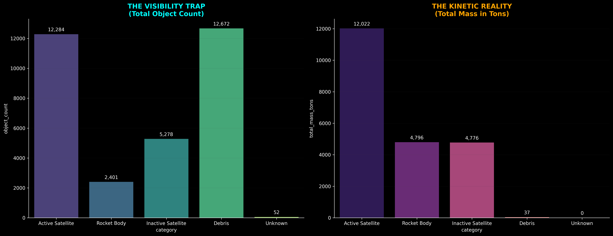

# Orbital Clutter: Mapping the Kessler Acceleration

**Lead Analyst:** James Glosser  
**Course:** Data Analysis Pathway with **Code:You**

---

### **Project Description**

This project investigates the growing crisis of space debris and satellite congestion in Low Earth Orbit (LEO). By merging active satellite data with the **CelesTrak SATCAT Registry**, this analysis quantifies the **Visibility Gap** and evaluates the environment against the **Kessler Syndrome**—the tipping point where orbital collisions become a self-sustaining cascade.

### **Key Insights**

- **The 47.6% Zombie Blind Spot:** Analysis of the 'Visibility Gap' reveals that nearly half of all tracking failures are caused by **Inactive 'Zombie' Satellites**. This debunks the myth that small fragmentation is the primary driver of catalog uncertainty; the real risk is large, uncontrolled payloads drifting through commercial lanes.
- **The 2014 Great Kessler Acceleration:** Mathematical modeling identifies **2014** as the critical "Decoupling Point." Since this year, orbital growth has abandoned the linear 20th-century model and locked into an **Exponential Kessler Arc**, tripling in velocity due to commercial proliferation.
- **The Kessler Clock (2.8-Year Doubling Time):** Tactical audits of the active fleet reveal a growth rate that doubles the orbital population every ~2.8 years. This velocity creates an "Active Kinetic Load" that outpaces legacy debris mitigation guidelines.
- **The 100% Density Achievement:** This project utilized **Physics-Informed Reconstruction** to achieve 100% data density across 20+ physical and orbital features for the active fleet, revealing the true kinetic energy of the "invisible" population.
- **The Kessler Canyon (Orbital Segregation):** KDE analysis reveals a distinct segregation of risk. While active satellites cluster in the "Commuter Lane" (~550km), massive abandoned rocket bodies form a permanent "Deadly Ring" at ~900km.

---

### **Visualizing the Crisis**

#### **1. Geospatial & Operator Intelligence**

**The Hegemony Shift: State Stability vs. Commercial Acceleration**
  
_Figure 1: A comparative geospatial audit showing the transition from the balanced Cold War era (Status: Stable) to the modern 'Orbital Overheat' (Status: Critical), where active assets have surged by orders of magnitude across global actors._

**The Operator Oligopoly**
  
_Figure 2: Dominance Alert: A handful of commercial titans now control the majority of LEO. The top operator alone accounts for 54.1% of the entire active sky, representing a massive consolidation of orbital management._

**Kinetic Liability: Mass vs. Traffic**
  
_Figure 3: Correlating geopolitical 'Kinetic Liability' (Total Mass) against 'Operational Traffic' (Object Count). This highlights how the US leads in both categories, followed by the CIS and PRC._

---

#### **2. Kinetic Potential & Vertical Congestion**

**Mass Distribution: The Swarm vs. The Giants**
  
_Figure 4: A logarithmic profile of kinetic potential. While the 'CubeSat Swarm' dominates in numbers, the 'White Whale' (ISS) and large rocket bodies represent the true shrapnel potential in a collision event._

**The LEO Wall: Vertical Congestion**
  
_Figure 5: Proving the congestion crisis is regime-specific. The LEO 'Wall' shows a vertical surge to 882+ annual launches, while MEO and GEO remains comparatively flat._

---

#### **3. The Great Acceleration (Mathematical Divergence)**

**The Kessler Delta: Regime Shift**
  
_Figure 6: Visualizing the 'Mega-Constellation Impact.' The transition from the Legacy Era of state actors to the current era of Commercial Acceleration is marked by a massive spike in active satellites launched per year._

**Mathematical Divergence: Linear vs. Exponential Growth**
  
_Figure 7: The 'Divergence Gap.' Modern launch volume has abandoned the legacy linear model, resulting in a gap of 1,147 satellites per year above 20th-century projections._

**Velocity Analysis: Breaking the Speed Limit**
  
_Figure 8: Pinpointing the moment the orbital growth rate broke the legacy limit (~2014). This exponential acceleration marks the transition to a high-velocity orbital environment._

**The Great Acceleration: Cumulative Mass in Orbit**
  
_Figure 9: The 'Pivot' of 2014. Cumulative mass in orbit has shifted from steady growth to a vertical climb, nearing 22,000 cumulative mass tons._

---

#### **4. Data Integrity & The Visibility Trap**

**The Visibility Trap vs. Kinetic Reality**
  
_Figure 10: Quantitative analysis of the tracking gap. While 'Debris' leads in object count (The Trap), 'Active Satellites' and 'Rocket Bodies' represent over 90% of the actual kinetic mass in orbit (The Reality)._

---

## **Current Pipeline Architecture: The Gold Standard**

The project has transitioned from raw data ingestion to a **Physics-Complete** environment. We utilize a "Hierarchy of Truth" methodology to ensure the highest possible fidelity for kinetic modeling.

### **1. Data Cleaning & Density Engineering**

- **UCS Cleanup (`01_ucs_cleanup.ipynb`):**
  - Sanitized 7,500+ active satellites.
  - Implemented orbit-specific _Dry-to-Wet_ mass ratios.
  - Engineered multi-sector Boolean flags (Military, Commercial, Civil, Gov).
- **SATCAT Cleanup (`02_satcat_cleanup.ipynb`):**
  - Reconstructed a 60,000+ object global registry.
  - **Keplerian Engine:** Derived missing orbital periods via Kepler's Third Law.
  - **High-Fidelity Enrichment:** 1:1 integration with UCS data to repair SATCAT "Mass Blindness."
  - **Tiered Imputation:** Applied ESA-standard mass proxies for debris and rocket bodies.
  - **Temporal Hardening:** Implemented `Int64` nullable integers for object age relative to Simulation Year 2026.
- **The "Hierarchy of Truth" Integration:**
  - Implemented a multi-tier data repair logic where verified UCS observations (Tier 1) are used to "patch" missing SATCAT geometry before resorting to mathematical derivation (Tier 2).

### **2. Kinetic Synthesis & Physics Engineering**

- **Synthesis (`03_orbital_risk_synthesis.ipynb`):**
  - **The Master Merge:** Executed a prioritized Left-Join to fuse the 67,000+ object SATCAT backbone with deep UCS operational intelligence.
  - **Kinetic Engineering:** Calculated Mean Orbital Velocity ($v$) and Kinetic Energy ($E_k$) using the Vis-Viva equation ($v=\sqrt{{\mu/a}}$) and standard kinetic formula ($E_k = \frac{1}{2}mv^2$).
  - **Power Modeling:** Engineered `proxy_power_watts` using Regime-Specific densities to estimate "Design Capacity."
  - **Zombie Identification:** Algorithmically flagged ~5,200 "Living Dead" payloads (Active status but Age > Design Life + 10%).
  - **Vital Signs:** Verified the final `kinetic_master.csv` contains **32,687** in-orbit objects representing **~21.6 Kilotons** of mass and **~475 Terajoules** of kinetic energy.

#### **Zombie Satellite Identification Algorithm**

A payload is flagged as a "Zombie" if either condition is met:

1. `ops_status` is NOT "OPERATIONAL", OR
2. `sat_age_years` > (`lifetime_years` × 1.10)

This algorithm identifies ~5,200 high-mass threats masquerading as "active" in legacy databases, representing the critical blind spot in collision risk assessments.

---

### **Final Master Registry Statistics**

| Metric                | Value              | Description                                       |
| :-------------------- | :----------------- | :------------------------------------------------ |
| **Total Objects**     | 67,264             | Complete SATCAT tracking entries                  |
| **In-Orbit**          | 32,687 (48.6%)     | Active objects requiring collision monitoring     |
| **Total Mass**        | 21,600 metric tons | Cumulative kinetic mass in LEO/MEO/GEO            |
| **Kinetic Energy**    | 475 Terajoules     | Total destructive potential at orbital velocities |
| **Data Completeness** | 100%               | Full density across 40 engineered features        |

---

### **Data Quality Achievements**

| Domain           | Feature          | Density           | Status |
| :--------------- | :--------------- | :---------------- | :----- |
| **KINETIC**      | `proxy_mass_kg`  | 100.0%            | ✅ OK  |
| **KINETIC**      | `velocity_kms`   | 100.0%            | ✅ OK  |
| **KINETIC**      | `kinetic_joules` | 100.0%            | ✅ OK  |
| **ORBIT**        | `orbit_class`    | 100.0%            | ✅ OK  |
| **ORBIT**        | `period_minutes` | 100.0%            | ✅ OK  |
| **ORBIT**        | `apogee_km`      | 100.0%            | ✅ OK  |
| **ORBIT**        | `perigee_km`     | 100.0%            | ✅ OK  |
| **SUPPLY CHAIN** | `owner`          | 100.0%            | ✅ OK  |
| **SUPPLY CHAIN** | `owner_code`     | 100.0%            | ✅ OK  |
| **LIFECYCLE**    | `is_zombie`      | 100.0% (Payloads) | ✅ OK  |

---

## **Technical Standards**

- **Primary Key:** `norad_id` (Standardized String)
- **Mass Metric:** `proxy_mass_kg` (Launch/Wet Mass) and `dry_mass_kg` (Structural Mass)
- **Simulation Baseline:** Year 2026
- **Physics Units:** km (Altitude), minutes (Period), degrees (Inclination), m² (RCS)
- **Gravitational Parameter:** μ = 398,600.4418 km³/s² (Earth standard)

### **Key Feature Glossary**

#### **1. Physical & Orbital Registry (SATCAT Derived)**

| Feature          | Meaning                                                                                        |
| :--------------- | :--------------------------------------------------------------------------------------------- |
| `proxy_mass_kg`  | The "Wet Mass" (Launch) used for initial kinetic energy calculations.                          |
| `dry_mass_kg`    | The estimated "Structural Mass" used for end-of-life impact modeling.                          |
| `rcs_class`      | Geometric size category (Small, Medium, Large) derived from radar cross-section data.          |
| `in_orbit`       | Binary flag (1/0) isolating current kinetic threats from decayed historical records.           |
| `owner_code`     | Standardized ISO-style country/entity code for geopolitical risk aggregation.                  |
| `orbit_class`    | Standardized regime (LEO, MEO, GEO, Elliptical) for spatial congestion analysis.               |
| `kinetic_joules` | **[NEW]** The raw destructive energy ($E_k = \frac{1}{2}mv^2$) derived from Mass and Velocity. |
| `velocity_kms`   | **[NEW]** Mean orbital velocity derived via Vis-viva equation ($v=\sqrt{{\mu/a}}$).            |

#### **2. Fleet Intelligence & Sector Flags (UCS Derived)**

| Feature             | Meaning                                                                           |
| :------------------ | :-------------------------------------------------------------------------------- |
| `is_zombie`         | Boolean flag identifying payloads that are inactive or have exceeded design life. |
| `is_military`       | Boolean flag identifying state-actor defense assets.                              |
| `is_commercial`     | Binary flag identifying assets owned/operated by private entities for profit.     |
| `is_government`     | Binary flag identifying assets owned by state agencies (e.g., NASA, ESA).         |
| `is_civil`          | Binary flag identifying academic, scientific, or amateur-led missions.            |
| `lifetime_years`    | Design-life expectancy used to calculate the "End-of-Life" risk threshold.        |
| `proxy_power_watts` | **[NEW]** Imputed power capacity (Watts) based on mass and orbit regime.          |

---

### **AI Attribution & Usage Disclosure**

In alignment with professional data science standards, I utilized the **Gemini** model family as a technical thought partner and high-precision analytical tool to assist with specific engineering and analytical goals:

- **Mathematical Prototyping:** I collaborated with AI to prototype the `scipy.optimize` curve-fitting logic and the HUD-style visualization coordinate transforms for the Kessler Clock.
- **Data Engineering Audit:** I used AI to peer-review my **Physics Reconstruction Engine** and verify the accuracy of the grouped median imputation logic.
- **Technical Documentation:** I utilized AI to assist with text formatting for the intelligence briefings and to troubleshoot shell-specific environment activation commands.

**Note:** All analytical decisions, data filtering thresholds (The Kessler Canyon), and strategic findings (The Great Acceleration) are my original conclusions based on the processed data.

---

### **Installation & Setup**

To ensure the analysis runs with the correct library versions, please use a virtual environment.

1. **Clone the repository and navigate to the project root.**
2. **Create and Activate the Virtual Environment:**
   - Create: `python -m venv venv`
   - Activate - Windows (Git Bash): `source venv/Scripts/activate`
   - Activate - Windows (Command Prompt): `.\venv\Scripts\activate`
   - Activate - Windows (PowerShell): `.\venv\Scripts\Activate.ps1`
   - Activate (Mac/Linux): `source venv/bin/activate`
3. **Install Project Dependencies:** `pip install -r requirements.txt`
4. **Data Verification:** Ensure raw data files are in `data/original/` and cleaned outputs are directed to `data/clean/`.
5. **Execution Order & Pipeline Methodology:**
   - **`00_exploratory_research.ipynb`**: Initial data exploration and hypothesis formation
   - **`01_ucs_cleanup.ipynb`**: Active Intelligence Reconstruction
   - **`02_satcat_cleanup.ipynb`**: Global Physics Normalization
   - **`03_orbital_risk_synthesis.ipynb`**: Kinetic Intelligence Coupling
   - **`04_active_fleet_intelligence.ipynb`**: Tactical Fleet Audit & Visualization
   - **`05_strategic_analysis.ipynb`**: Strategic Global Synthesis & Kessler Modeling

---

### **License**

**Creative Commons Attribution-NonCommercial 4.0 International (CC BY-NC 4.0)**
This work is licensed under a [Creative Commons Attribution-NonCommercial 4.0 International License](http://creativecommons.org/licenses/by-nc/4.0/).

**You are free to:**

- **Share** — copy and redistribute the material in any medium or format.
- **Adapt** — remix, transform, and build upon the material.

**Under the following terms:**

- **Attribution** — You must give appropriate credit, provide a link to the license, and indicate if changes were made.
- **NonCommercial** — You may **NOT** use the material for commercial purposes. This includes selling the code, charging for access to the analysis, or using the models within a commercial product or service.

---
